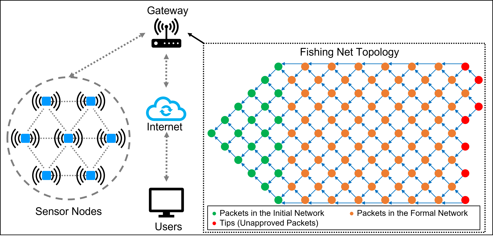

# Fishing Net Topology (FNT)
### A Novel Blockchain Structure for Wireless Sensor Networks Based on IOTA Tangle

> Graphical Abstract: 

>We clarify the following terminology for the FNT:  
Packet: refers to the packet that contains the sensor data.  
Auditee: an entity in the FNT that is approved by the new node. It can also be referred to as the Tip.  
Auditor: an entity in the FNT that approves the new node. It can also be referred to as the Approver.

>Files:
>>[FNT:](FNT.py) Main class of FNT.  
>>[Demo:](Demo.ipynb) Function demonstration of FNT.
> 
>>Version1: FNT original proposal and simple implementation for generating graphs and experimental data in the paper.  
>>>[Ver1Demo1:](Ver1Demo1.ipynb) Simple functional experiments.  
>>>[Ver1Demo2:](Ver1Demo2.ipynb) Simple visualization experiments.  

> Author: Hongwei Zhang  
> Last Update: June 23, 2022