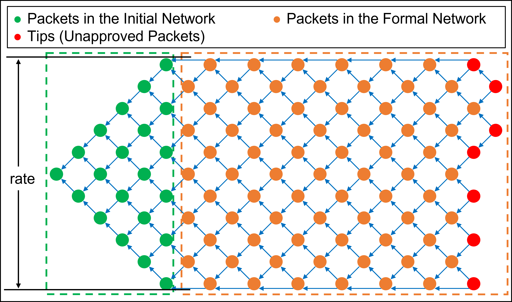
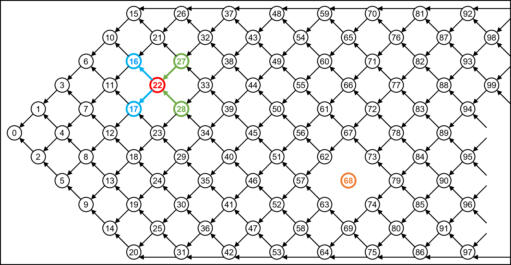
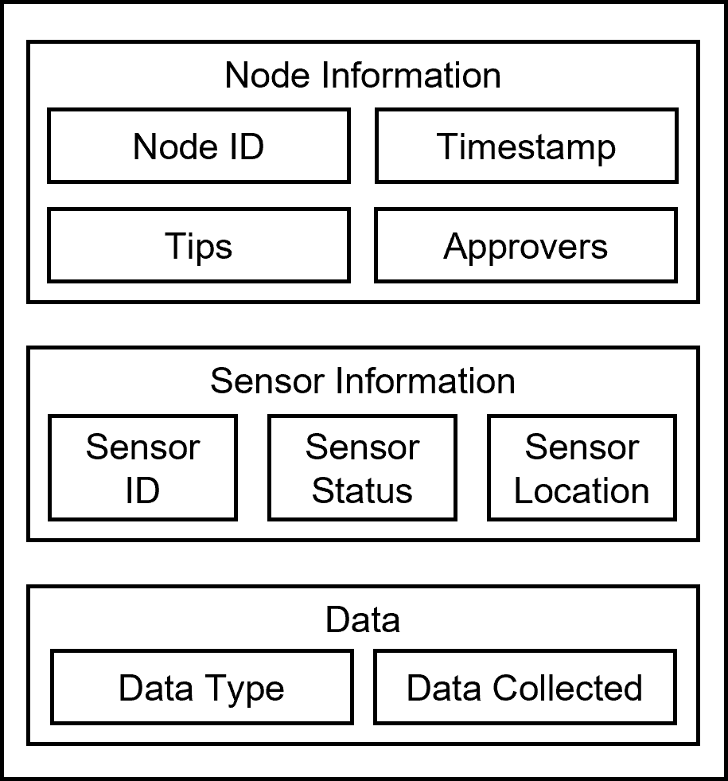

# Fishing Net Topology (FNT)
### A Novel Blockchain Structure for Wireless Sensor Networks Based on IOTA Tangle

> Graphical Abstract: 

> Rate: 

> Tips, Approvers, and Node Detach: 

> Node Structure: 

>Files
>>DemoVersion: Simple implementation of concepts and basic functions.  
>>>[DemoFNT:](DemoVersion/DemoFNT.py) The main class of the demo version of FNT.  
>>>[DemoGraph:](DemoVersion/DemoGraph.py) The visualization class for the demo version of FNT.  
>>>[SampleFNT_1:](DemoVersion/SampleFNT_1.ipynb) Sample demo of DemoFNT class.  
>>>[SampleFNT_2:](DemoVersion/SampleFNT_2.ipynb) Sample demo of DemoGraph class.  
> 
>>DevVersion: The version is currently under development and temporarily unavailable.
>>>FNT: Main functions.  
>>>Test: Test File.

> Note: Please focus on DemoVersion, other files are in development.

> Author: Hongwei Zhang

> Last Update: May 25, 2022