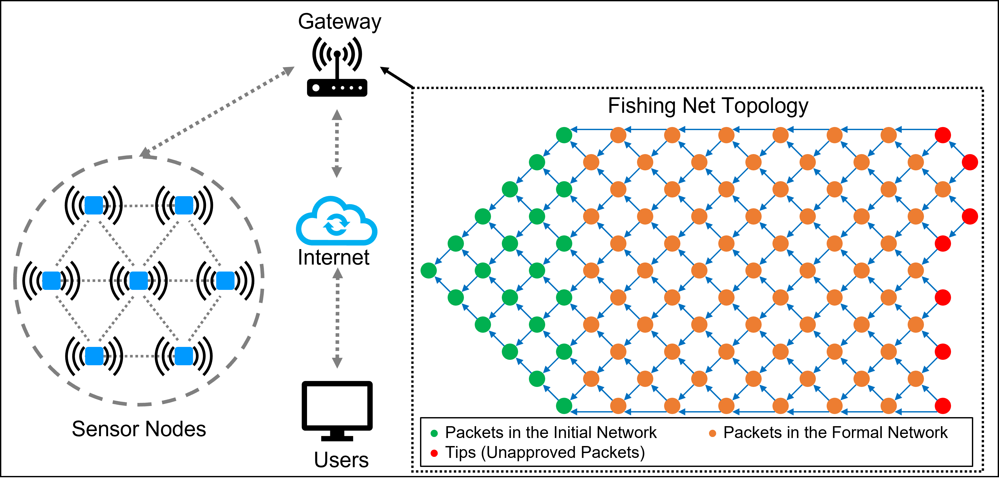

# Fishing Net Topology (FNT)
### A Novel Blockchain Structure for Wireless Sensor Networks Based on IOTA Tangle

> Graphical Abstract: 

>Files
>>[FNT:](FNT.py) Main class of FNT.  
>>[Demo:](Demo.ipynb) Function demonstration of FNT.
> 
>>Version1: Simple implementation of concepts and basic functions.  
>>>[FNTVer1:](Version1/FNTVer1.py) The main class of the demo version of FNT.  
>>>[Graph:](Version1/Graph.py) The visualization class for the demo version of FNT.  
>>>[Ver1Demo1:](Version1/Ver1Demo1.ipynb) Sample demo of DemoFNT class.  
>>>[Ver1Demo2:](Version1/Ver1Demo2.ipynb) Sample demo of DemoGraph class.  

> Author: Hongwei Zhang
> 
> Last Update: June 22, 2022