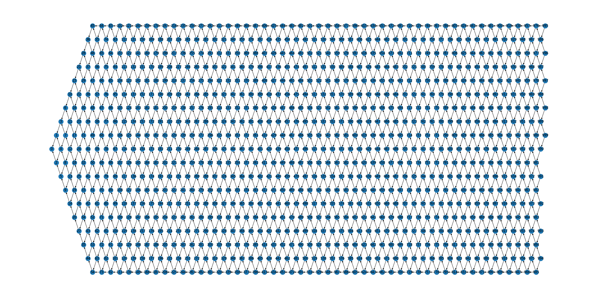
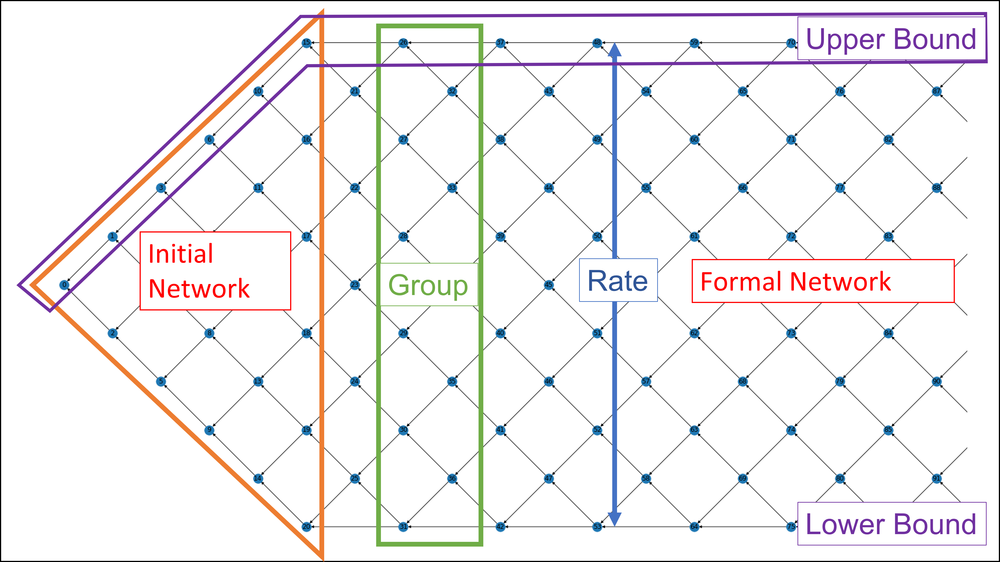

# Fishing Net Topology
**A Novel Blockchain Structure for WSNs Based on IOTA Tangle**

### Structural Demonstration:
**Example with the rate of 10, including 1000 nodes.**

### Files:
- **[FNT:](FNT.py) Main File of Fishing Net Topology, contains FNT class and Node class.**
- **[Graph:](Graph.py) Draw graphs related to FNT.**
- **[ExperimentData:](ExperimentData.ipynb) Data presentation and experimentation.**
- **[ExperimentChart:](ExperimentChart.ipynb) Graphical presentation and experimentation.**

### User Guide:
1. **Import libraries**
    ~~~
   import FNT
   import Graph
    ~~~
2. **Create FNT, insert nodes**
    ~~~
   fnt = FNT.FishingNet(rate)
   fnt.nextNode(data, time)
    ~~~
3. **Functions**
    ~~~
   fnt.findNode(index)                 # Print a node
   fnt.findTips(index)                 # Print tips for this node
   fnt.findApprover(index)             # Find two nodes that approved this node
   fnt.findCW(index)                   # Compute the cumulative weight for a node
   fnt.findSubnet(index)               # Find all nodes that directly or indirectly approved this node
   fnt.disableNode(index)              # Detach a node
   fnt.printFNT()                      # Print all nodes
   fnt.findThroughput():               # Return the list of throughput at each layer
   fnt.findUtilization():              # Calculate the utilization of each layer
   fnt.findWaste():                    # Calculate the waste rate of each layer
   fnt.findCumWaste():                 # Calculate the cumulative waste rate at each layer
   fnt.findWasteRate():                # Calculate the waste rate of entire network
   
   Graph.drawFNT(fnt)                  # Draw a FNT graph
   Graph.drawCWs(fnt)                  # Show the cumulative weight of all nodes
   Graph.drawCWChg(fnt, index)         # Show the growth of CW of a node as number of nodes increases
   Graph.drawThroughput(fnt)           # Show the throughput of each layer
   Graph.drawUtilization(fnt):         # Show the utilization of each layer
   Graph.drawWasteRate(fnt):           # Show the waste rate of each layer
   Graph.drawCumWaste(fnt):            # Show the cumulative waste rate
    ~~~

### Structural Explanation:
**Example with the rate of 6, including 100 nodes.**

### Author
**Hongwei Zhang**