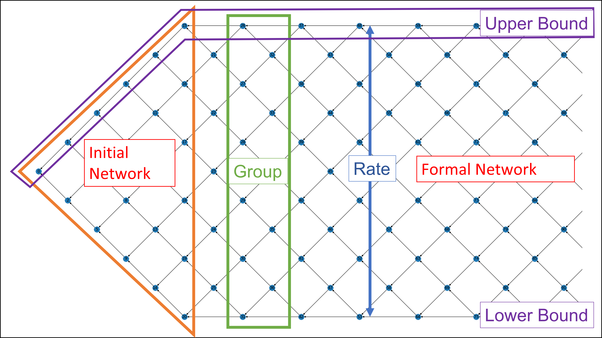

# Fishing Net Topology

## A Novel Blockchain Structure for WSNs Based on IOTA Tangle

### Structural Demonstration:
#### Example with the rate of 10, including 1000 nodes.

### Structural Explanation:
#### Example with the rate of 6, including 100 nodes.

### Files:
- [FNT:](FNT.py)
Main File of Fishing Net Topology, contains FNT class and Node class.
- [Visualization:](Visualization.py) Draw the FNT structure graph.
- [Test:](Test.ipynb) Experiments and feature showcases.

