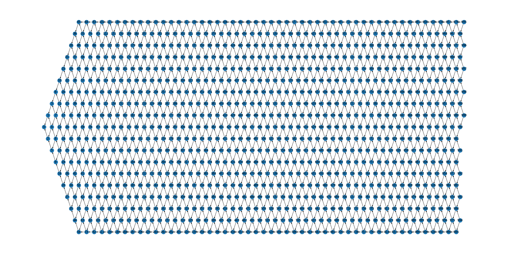

# Fishing Net Topology

## A Novel Blockchain Structure for WSNs Based on IOTA Tangle

### Files
- [FNT:](FNT.py)
Main File of Fishing Net Topology, contains FNT class and Node class.
- [Visualization:](Visualization.py) Draw the FNT structure graph.
- [Test:](Test.py) Sample test file.

